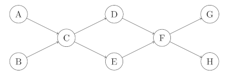
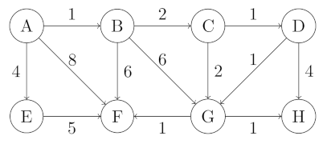

# Algorithms

University of Colorado - Boulder

CS 3104

Summer 2015

Book: *Algorithms* by Dasgupta, Papadimitriou, and Vazirani

https://www.amazon.com/Algorithms-Sanjoy-Dasgupta/dp/0073523402

## Assignment 1

### Problem 1

In each of the following situations, indicate whether $`f=O(g)`$, or $`f=\Omega(g)`$ or both (in which case $`f=\Theta(g)`$).

- $`f(n) = n^{1.01}, \, g(n) = n`$
- $`f(n) = \lg n, \, g(n) = \ln n`$
- $`f(n) = 2^n, \, g(n) = 3^n`$

### Problem 2

Compute the 200th Fibonacci number.

### Problem 3

Consider the following Python function:

```python
def find(a, target):
    x = 0
    y = len(a)
    while x < y:
        m = (x+y)/2
        if a[m] < target:
            x = m+1
        elif a[m] > target:
            y = m
        else:
            return m
    return -1
```

Suppose list $`a`$ has $`n`$ elements and is sorted.  Using $`\Theta()`$ notation, what is the best case running time as a function of $`n`$?  Using $`\Theta()`$ notation, what is the worst case running time as a function of $`n`$?

### Problem 4

Modify the find function from problem 3 by changing the 5th line from $`m=(x+y)/2`$ to $`m=(2*x+y)/3`$.  Now answer the same questions given in problem 3.

### Problem 5

Consider this sorting algorithm, written in Python:
```python
def bsort(a):
    swapped = True
    while swapped:
        swapped = False
        for i in range(0, len(a)-1):
            if a[i] > a[i+1]:
                a[i], a[i+1] = a[i+1], a[i]
                swapped = True
```
- Is this sort randomized or deterministic?
- What is the value of the best-case input?
- Using $`\Theta`$ notation, what is the best-case running time of this program?
- What is the value of the worst-case input?
- Using $`\Theta`$ notation, what is the worst-case running time of this program?

### Problem 6

Consider this sorting algorithm, written in Python:

```python
import random

def luckysort(a):
    sorted = False
    while not sorted:
        random.shuffle(a)
        sorted = True
        for i in range(0, len(a)-1):
            if a[i] > a[i+1]:
                sorted = False
```

- Is this sort randomized or deterministic?
- What is the value of the best-case input?
- Using $`\Theta`$ notation, what is the best-case running time of this program?
- What is the value of the worst-case input?
- Using $`\Theta`$ notation, what is the worst-case running time of this program?
- Using $`\Theta`$ notation, what is the expected running time of this program?

### Problem 7

Suppose you are choosing between the following three algorithms:
- Algorithm $`A`$ solves each problem by dividing them into five subproblems of half the size, recursively solving each subproblem, and then combining the solutions in linear time.
- Algorithm $`B`$ solves problems of size $`n`$ by recursively solving two problems of size $`n-1`$, and then combining the solutions in constant time.
- Algorithm $`A`$ solves problems of size $`n`$ by dividing them into nine subproblems of size $`n/3`$, recursively solving each subproblem, and then combining the solutions in $`O(n^2)`$ time.


What are the running times of each of these algorithms in (in big-$`O`$ notation), and which would you choose?

### Problem 8

How many lines, as a function of $`n`$ (in $`\Theta(\cdot)`$ form), does the following program print?  Write a recurrence and solve it.  You may assume $`n`$ is a power of 2.

```
function f(n)
    if n > 1:
        print_line("still going")
        f(n/2)
        f(n/2)
```

### Problem 9

Given a sorted array of distinct integers $`A[1,\ldots,n]`$, you want to find out whether there is an index $`i`$ for which $`A[i] = i`$.  Give a divide-and-conquer algorithm that runs in time $`O(\log n)`$.

### Problem 10

Let $`A`$ and $`B`$ be arrays of integers.  Each array contains $`n`$ elements, and each array is in sorted order (ascending). $`A`$ and $`B`$ do not share any elements in common. Give an $`O(\log n)`$-time algorithm which finds the median of $`A`$ union $`B`$. In other words, find the median of the $`2n`$ elements given by putting $`A`$ and $`B`$ together into one array.

### Problem 11

The text doesn't implement their algorithm for Selection.  Please do so.  Then, compute the median (alphabetically) of the list of words given (in [wordlst.txt](wordlst.txt)) using your algorithm.

## Assignment 2

### Problem 1

Run the DFS-based topological ordering algorithm on the following graph.  Whenever you have a choice of vertices to explore, always pick the one that is alphabetically first.



- Indicate the pre and post numbers of the nodes.
- What are the sources and sinks of the graph?
- What topological ordering is found by the algorithm?
- How many topological orderings does the graph have?

### Problem 2

*Pouring water.*  We have three containers whose sizes are 10 pints, 7 pints, and 4 pints, respectively.  The 7-pint and 4-pint containers start out full of water, but the 10-pint container is initially empty.  We are allowed one type of operation: pouring the contents of one container into another, stopping only when the source container is empty or the destination container is full.  We want to know if there is a sequence of pourings that leaves exactly 2 pints in the 7- or 4-pint container.

- Model this as a graph problem: give a precise definition of the graph involved and state the specific question about this graph that needs to be answered.

What algorithm should be applied to solve the problem?

### Problem 3

Suppose you are trying to buy a digraph from a salesman Joe. You tell Joe that your graph cannot have any odd-length cycles, and must be strongly-connected. Joe says he has just the thing, and he shows you just three edges of it: $`(a, b), (b, c)`$ and $`(a, c)`$. Explain why Joe must be lying. (Note: there might be a LOT more edges, but you have to base your answer on just the three you can see.)

### Problem 4

Give a linear-time algorithm to find an odd-length cycle in a *directed* graph.  (*Hint:* First solve the problem under the assumption that the graph is strongly connected.)
    
### Problem 5
Give an efficient algorithm that takes as input a directed acyclic graph $`G=(V,E)`$, and two vertices $`s,t\in V`$, and outputs the number of different directed paths from $`s`$ to $`t`$ in $`G`$.
    
### Problem 6

Give a linear-time algorithm for the following task.

*Input:* A directed acyclic graph $`G`$

*Question:* Does $`G`$ contain a directed path that touches every vertex exactly once?

Justify the correctness and running time of your algorithm. (Note that it says dag and *not* digraph. If we ask the same problem about a digraph, there is no known polynomial-time algorithm!)

### Problem 7

A *chain of words* is a list of words where the i-th word is the (i-1)st word with one extra character and some mixing of letters. For example, AN, TAN, RANT, TRAIN, RETINA, NASTIER is a chain of length 6.  Find the longest chain you can in our wordlist [wordlst.txt](wordlst.txt).

## Assignment 3

### Problem 1


Suppose Dijkstra's algorithm is run on the following graph, starting at node $`A`$.



- Draw a table showing the intermediate distance values of all the nodes at each iteration of the algorithm.
- Show the final shortest-path tree

### Problem 2

Here's a proposal for how to find the length of the shortest cycle in an undirected graph with unit edge lengths:

>>>
When a back edge, say $`(v,w)`$, is encountered during a depth-first search, it forms a cycle with the tree edges from $`w`$ to $`v`$.  The length of the cycle is level$`[v]`$ - level$`[w]`$ + 1, where the level of a vertex is its distance in the DFS tree from the root vertex. This suggests the following algorithm:

- *Do a depth-first search, keeping track of the level of each vertex.*
- *Each time a back edge is encountered, compute the cycle length and save it if it is smaller than the shortest one previously seen.*
>>>

Show that this strategy does not always work by providing a counterexample as well as a brief (one or two sentence) explanation.

### Problem 3

Professor F. Lake suggests the following algorithm for finding the shortest path from node $`s`$ to node $`t`$ in a directed graph with some negative edges: add a large constant to each edge weight so that all the weights become positive, then run Dijkstra's algorithm starting at node $`s`$, and return the shortest path found to node $`t`$.

Is this a valid method?  Either prove that it works correctly, or give a counterexample.

### Problem 4

Consider a directed graph in which the only negative edges are those that leave $`s`$; all other edges are positive.  Can Dijkstra's algorithm, started at $`s`$, fail on such a graph?  Prove your answer.  (Assume that the graph has no negative-weight cycles).

### Problem 5

Give an algorithm that takes as input a directed graph with positive edge lengths, and returns the length of the shortest cycle in the graph (if the graph is acyclic, it should say so).  Your algorithm should take time at most $`O(|V|^3)`$.

### Problem 6

In cases where there are several different shortest paths between two nodes (and edges have varying lengths), the most convenient of these paths is often *the one with fewest edges*.  For a specific starting node $`s`$, define

```math
\verb"best"[u] = \text{minimum number of edges in a shortest path from $s$ to $u$}
```

Give an efficient algorithm for the following problem.

- *Input:* Graph $`G = (V,E)`$; positive edge lengths $`l_e`$; starting node $`s\in V`$.

- *Output:* The values of best$`[u]`$ should be set for *all* nodes $`u\in V`$.

### Problem 7

*Generalized shortest-paths problem*.  Suppose that in addition to having edge lengths $`\{l_e : e \in E\}`$, a graph also has *vertex costs* $`\{c_v : v \in V\}`$.  Now define the cost of a path to be the sum of its edge lengths, *plus* the costs of all vertices on the path (including the endpoints).  Give an efficient algorithm for the following problem.

- *Input:* A directed graph $`G = (V,E)`$; positive edge lengths $`l_e`$ and positive vertex costs $`c_v`$; a starting vertex $`s\in V`$.

- *Output:* An array cost$`[\cdot]`$ such that for every vertex $`p`$, cost$`[u]`$ is the least cost of any path from $`s`$ to $`u`$ (i.e., the cost of the cheapest path), under the definition above.

### Problem 8

Consider the digraph given by this graph [soc-Slashdot0811.txt](soc-Slashdot0811.txt) where each line of the file indicates an edge. There are 77,360 nodes and 905,468 directed edges. What is the number of nodes in the largest strongly connected component? What is the number of edges in the largest strongly connected component? Include your code with your answer.


